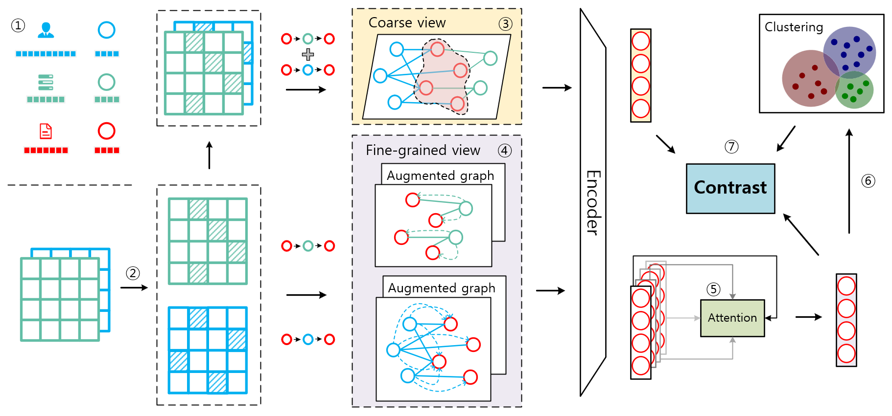

# Heterogeneous Graph Contrastive Learning with Meta-path Contexts and Weighted Negative Samples (SDM 2023)
 <!--
 A heterogeneous graph contrastive learning model that considers both meta-path contexts and weighted negative samples.
 https://arxiv.org/abs/2212.13847
 -->

## MEOW
This is the source code of paper ["Heterogeneous Graph Contrastive Learning with Meta-path Contexts and Weighted Negative Samples"](https://arxiv.org/abs/2212.13847)


## Environment Settings
> python==3.9.0 \
> scipy==1.8.1 \
> torch==1.12.0 \
> numpy==1.23.0 \
> scikit_learn==1.1.1\
> faiss-gpu==1.7.2

## Usage
Fisrt, go into ./code, and then you can use the following commend to run our model: 
> python main.py acm --gpu=0

Here, "acm" can be replaced by "dblp", "aminer".


Some files in the './data' could not be uploaded because they were over 25MB. 
All the data files we store in 
url：https://pan.baidu.com/s/1vlBrC4S7EZgowGyHGF8apg 
pwd：n84e

## Citation
```
@inbook{doi:10.1137/1.9781611977653.ch5,
author = {Jianxiang Yu and Xiang Li},
title = {Heterogeneous Graph Contrastive Learning with Meta-path Contexts and Weighted Negative Samples},
booktitle = {Proceedings of the 2023 SIAM International Conference on Data Mining (SDM)},
chapter = {},
pages = {37-45},
doi = {10.1137/1.9781611977653.ch5},
URL = {https://epubs.siam.org/doi/abs/10.1137/1.9781611977653.ch5},
eprint = {https://epubs.siam.org/doi/pdf/10.1137/1.9781611977653.ch5},
}
```
